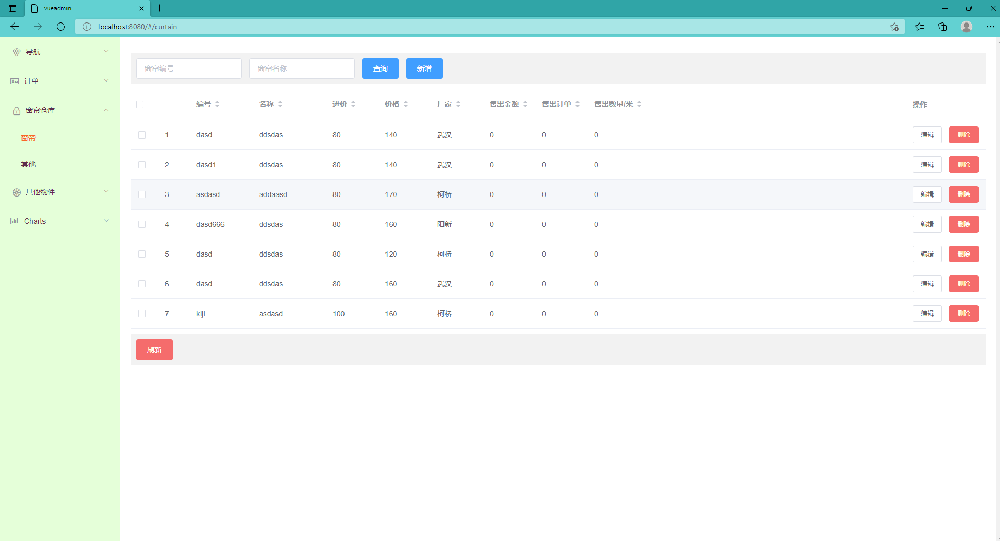
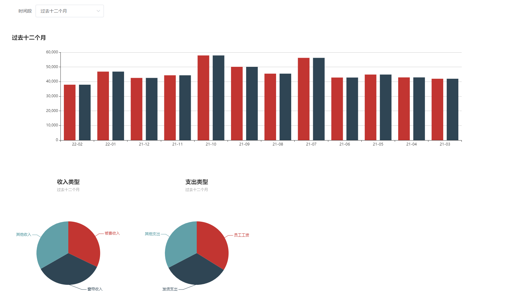

# **CurtainSystem窗帘订单系统**

该项目主要实现窗帘订单的创建、查找、订单一键的打印、账单的记录、自动发货等功能。



## 开始

```bash
#need tow terminal

#start front server
cd server
npm install
npm run dev

#start back server

go run main.go
```


## 联系我

tanhuigen1101@mail.ustc.edu.cn




## 系统环境

前端：node14.19.0 + vue +elementUI

后端：go1.17 +gin+gorm v2

## 项目结构

```
├─ManageSystem   #后端
│  ├─.idea
│  ├─callBackResponse
│  ├─controller
│  ├─db
│  ├─file
│  ├─global
│  ├─initialize
│  ├─middleware
│  └─utils
└─server  #前端
    ├─.idea
    ├─build
    ├─config
    ├─dist
    │  └─static
    │      ├─css
    │      ├─fonts
    │      ├─img
    │      └─js
    ├─pdfFile
    ├─src
    │  ├─api
    │  ├─assets
    │  │  └─theme
    │  │      ├─theme-darkblue
    │  │      │  └─fonts
    │  │      └─theme-green
    │  │          └─fonts
    │  ├─common
    │  │  └─js
    │  ├─components
    │  ├─mock
    │  │  └─data
    │  ├─styles
    │  ├─views
    │  │  ├─charts
    │  │  ├─nav1
    │  │  ├─nav2
    │  │  └─nav3
    │  └─vuex
    └─static
```

## 证书

MIT LICENCE